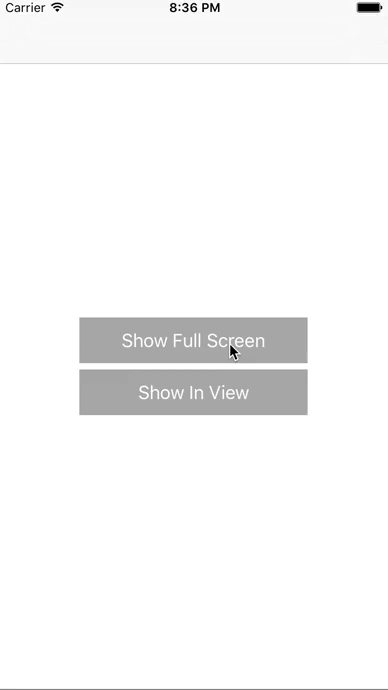

# OriginateActionSheet
[](https://travis-ci.org/Originate/OriginateActionSheet)

> A customizable alternative to the built-in UIActionSheet.

<div align="center">
    
</div>

# Installation with CocoaPods
Add the following lines to your Podfile and run `pod install`.

```ruby
source 'https://github.com/Originate/CocoaPods.git'
pod 'OriginateActionSheet'
```

# Requirements
- iOS 8.0+

# Usage

For a detailed example please consult the example project.

## Import the Framework

Add the following line wherever you want to access the framework:
```objective-c
@import OriginateActionSheet;
```

# License
OriginateActionSheet is available under the MIT license. See the LICENSE file for more info.
